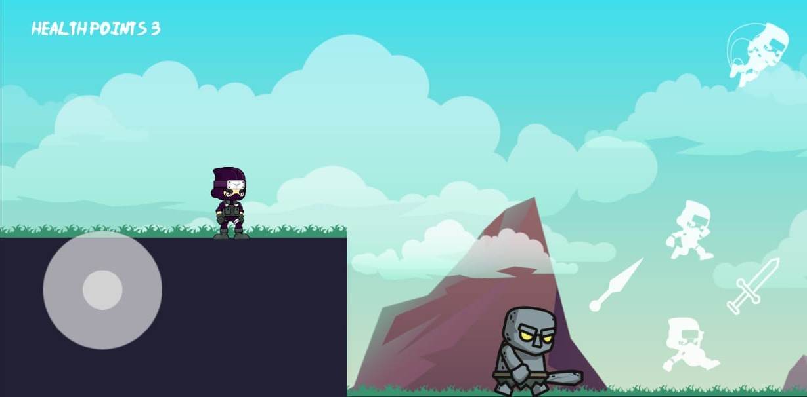

# Little ninja game
## Simple mobile platformer game made with Godot engine

Hi , this is a basic mobile platformer game that I made with godot engine.
It has all the basic elements of a platformer game you can import it in godot engine and add your further changes as per your vision.

* I have only made one level so that you can add as many as you want according to you.
* I have added mobile controls as well if you dont want that you can comment the code from src/menus/JoystickButton.gd from line 26 to 56.
Happy game jamming !!

If anyone can improve upon it don't hesitate to send a pull request. :)  
You can download and run this game from [here](https://drive.google.com/file/d/1SRJVpihFzcpVxHWa2g5q29RtdsknBwx8/view?usp=sharing)
